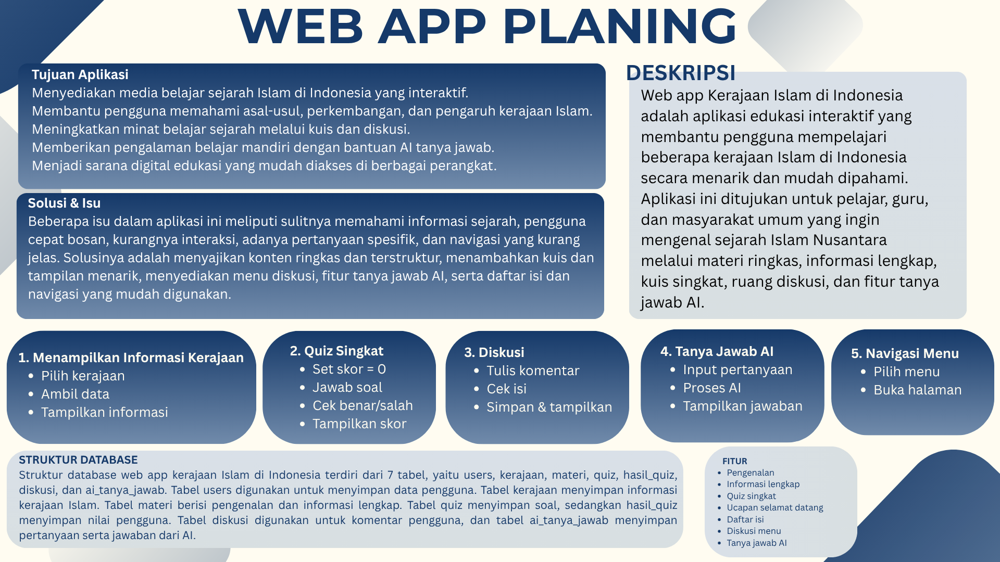

# 🕌 Kerajaan Islam Nusantara

Web aplikasi edukatif tentang Kerajaan Islam Mataram. Dibuat sebagai tugas mata pelajaran **Informatika & Sejarah** — SMK IT Smart Informatika Surakarta.


---

## Fitur

| Fitur | Deskripsi |
|---|---|
| 📖 Info Kerajaan | Detail 6 kerajaan Islam: sejarah, raja, dan peninggalan |
| 🎯 Kuis Interaktif | 5 soal acak dari 15 pertanyaan pilihan ganda |
| 💬 Forum Diskusi | Komentar & balasan dengan verifikasi Cloudflare Turnstile |
| 🤖 MATARA AI | Asisten AI berbasis Groq (LLaMA 3.1) khusus sejarah Islam Nusantara |

## Kerajaan yang Dibahas

- Kesultanan Mataram Islam (1586–1755)
- Kadipaten Pakualam
- Kadipaten Mangkunegara

---

## Tech Stack

- **Frontend:** HTML, Tailwind CSS, Alpine.js
- **Backend:** Node.js, Express.js
- **Database:** Firebase Realtime Database
- **AI:** Groq API (model `llama-3.1-8b-instant`)
- **Keamanan:** Cloudflare Turnstile (anti-spam diskusi)

---

## Instalasi & Menjalankan

### Prasyarat
- Node.js v18+
- Akun Firebase
- API Key Groq
- Cloudflare Turnstile key

### Langkah

1. Clone repositori
   ```bash
   git clone https://github.com/<username>/MataramKingdom.git
   cd MataramKingdom
   ```

2. Install dependensi
   ```bash
   npm install
   ```

3. Buat file `.env` di root proyek
   ```env
   FIREBASE_API_KEY=<firebase-api-key>
   FIREBASE_AUTH_DOMAIN=<project>.firebaseapp.com
   FIREBASE_DATABASE_URL=https://<project>.firebaseio.com
   FIREBASE_PROJECT_ID=<project-id>
   FIREBASE_STORAGE_BUCKET=<project>.appspot.com
   FIREBASE_MESSAGING_SENDER_ID=<sender-id>
   FIREBASE_APP_ID=<app-id>

   GROQ_API_KEY=<groq-api-key>
   TURNSTILE_SECRET_KEY=<turnstile-secret-key>

   PORT=3000
   ```

4. Jalankan server
   ```bash
   # Production
   npm start

   # Development (auto-reload)
   npm run dev
   ```

5. Buka browser di `http://localhost:3000`

---

## Struktur Proyek

```
MataramKingdom/
├── assets/          # Gambar & logo
├── components/      # Navbar desktop & mobile
├── css/             # Stylesheet
├── data/
│   ├── kingdoms.json  # Data 6 kerajaan Islam
│   └── quiz.json      # Soal kuis
├── js/              # Script frontend
├── pages/           # Halaman quiz, diskusi, MATARA AI
├── index.html       # Halaman utama
├── server.js        # Backend Express
└── .env             # Konfigurasi (tidak di-commit)
```

---

## API Endpoints

| Method | Endpoint | Deskripsi |
|---|---|---|
| `GET` | `/api/diskusi` | Ambil semua komentar |
| `POST` | `/api/diskusi` | Kirim komentar baru |
| `POST` | `/api/diskusi/:id/balasan` | Kirim balasan komentar |
| `POST` | `/api/matara` | Tanya MATARA AI |

---

## Tim Pengembang

| Nama | Peran |
|---|---|
| Faris | Product Management & Developer |
| Fikri | Riset & Developer |
| Dzikrul | Designer & Management|
| Rizal | Content Writer & Riset |
| Nabil | Head of Designer & UI/UX|

> Tugas Informatika & Sejarah · SMK IT Smart Informatika Surakarta

---

## Lisensi

Lihat file [LICENSE](LICENSE).
